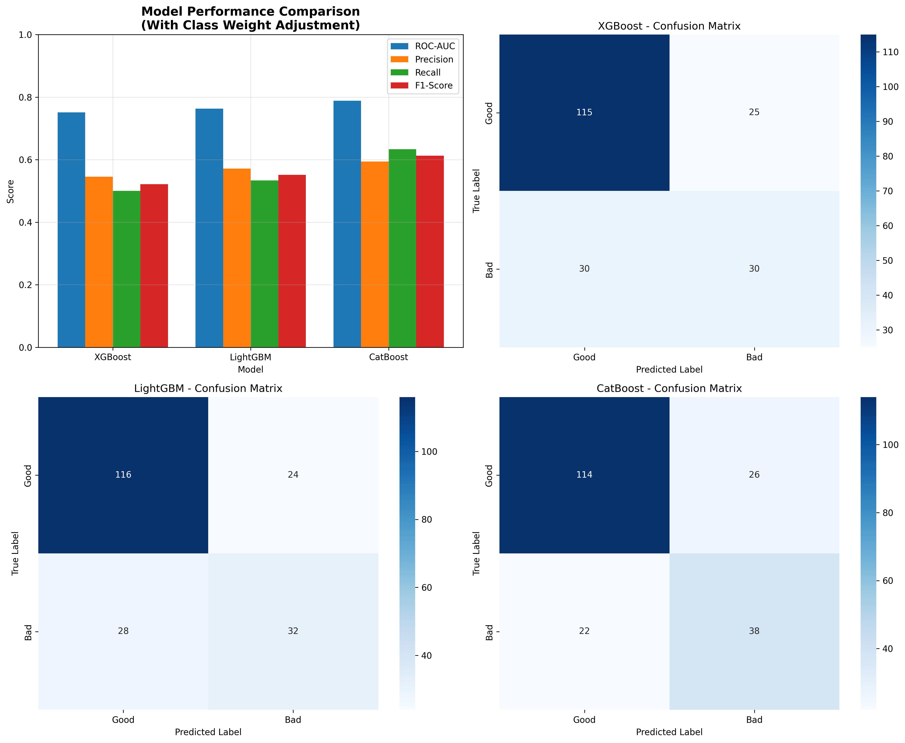
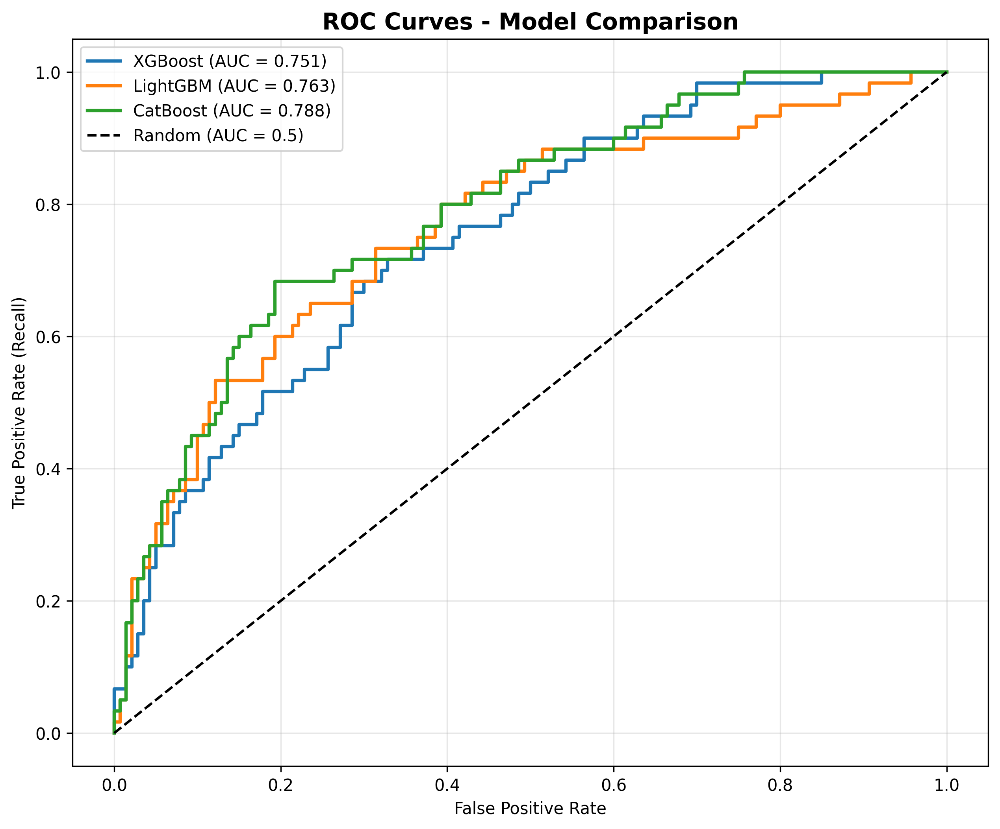
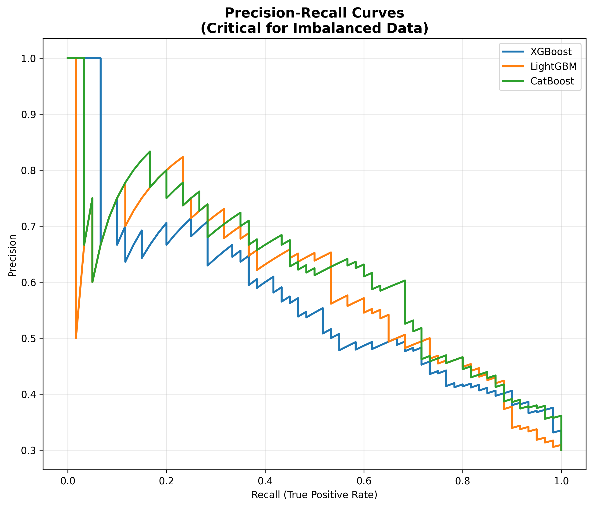
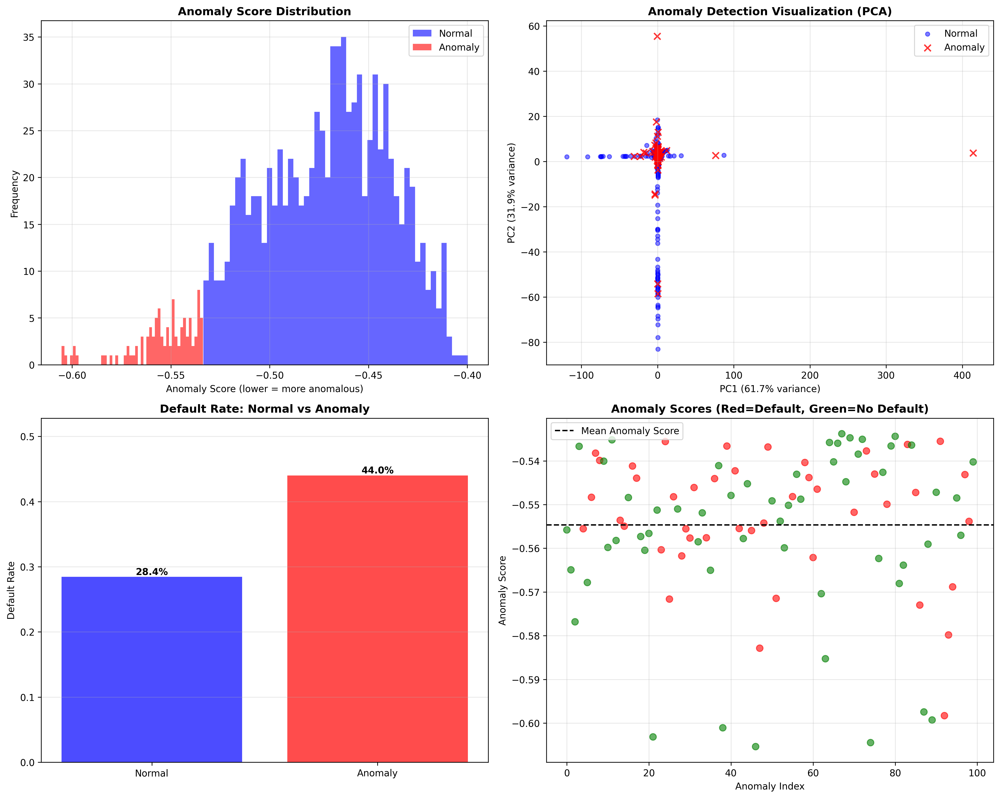

# Credit Risk Classification System

A machine learning system for predicting loan default using gradient boosting models (XGBoost, LightGBM, CatBoost) with proper handling of class imbalance and anomaly detection for fraud identification.

## 🎯 Project Overview

This project demonstrates a production-ready approach to credit risk assessment, addressing the challenge of imbalanced datasets through stratified sampling, class weight adjustment, and proper evaluation metrics.

**Key Features:**
- Multi-model comparison: XGBoost, LightGBM, CatBoost
- Class imbalance handling: Stratified sampling, class weights
- Anomaly detection: Isolation Forest for fraud identification
- Proper evaluation: Precision-Recall, ROC-AUC (not just accuracy)
- Feature engineering pipeline (30 features including 10 engineered)

## 📊 Dataset

**Source:** UCI German Credit Data  
**Samples:** 1,000 credit applications  
**Features:** 20 base attributes (credit history, employment, purpose, duration, etc.)  
**Target:** Default (30%) vs Non-Default (70%)  
**Challenge:** Class imbalance (1:2.3 ratio) requiring careful handling

## Project Structure

```
credit-risk-classification/
├── README.md                      # This file
├── requirements.txt               # Python dependencies
├── data/
│   └── german_credit_data.csv    # Dataset (auto-downloaded)
├── notebooks/
│   └── exploratory_analysis.ipynb # Data exploration
├── src/
│   ├── load_data.py              # Data loading and preprocessing
│   ├── feature_engineering.py    # Feature creation
│   ├── train_models.py           # Model training & comparison
│   └── anomaly_detection.py      # Isolation Forest fraud detection
└── results/
    ├── model_comparison.png      # Model performance plot
    ├── confusion_matrices.png    # Confusion matrix comparison
    └── feature_importance.png    # Feature importance plot
```

## Quick Start

### 1. Install Dependencies

```bash
pip install -r requirements.txt
```

### 2. Run Complete Pipeline

```bash
# Load and preprocess data
python src/load_data.py

# Train all models with class imbalance handling
python src/train_models.py

# Run anomaly detection
python src/anomaly_detection.py
```

## 📈 Results

### Model Performance (Stratified Split, Class Weights)

| Model | ROC-AUC | Precision | Recall | F1-Score |
|-------|---------|-----------|--------|----------|
| **CatBoost** | **0.788** | **0.594** | **0.633** | **0.613** |
| LightGBM | 0.763 | 0.571 | 0.533 | 0.552 |
| XGBoost | 0.751 | 0.545 | 0.500 | 0.522 |

**Best Model:** CatBoost with class weight adjustment
- **ROC-AUC: 0.788** - Good discrimination between default and non-default
- **Recall: 63.3%** - Correctly identifies 2 out of 3 defaults
- **Precision: 59.4%** - About 6 out of 10 flagged loans are actual defaults
- **Overall Accuracy: 76%** on test set (200 samples)

### Anomaly Detection Results

**Isolation Forest identified 100 anomalous credit applications (10.0%)**
- **Default rate among normal applications:** 28.4%
- **Default rate among anomalous applications:** 44.0%
- **Risk multiplier:** 1.5x higher default rate in anomalies
- Successfully identifies high-risk profiles with unusual feature patterns
- Provides risk stratification (Critical/High/Medium/Low) for manual review

### Visualizations

All results visualizations are saved in the `results/` folder:


*Figure 1: Performance comparison across XGBoost, LightGBM, and CatBoost*


*Figure 2: ROC curves showing model discrimination capability*


*Figure 3: Precision-recall trade-offs for imbalanced classification*


*Figure 4: Anomaly detection analysis with PCA visualization and risk distribution*

## Key Technical Approaches

### 1. **Stratified Sampling**
```python
# Maintains 30% default rate in both train and test sets
X_train, X_test, y_train, y_test = train_test_split(
    X, y, test_size=0.2, stratify=y, random_state=42
)
```

### 2. **Class Weight Adjustment**
```python
# XGBoost: Penalize default misclassification more heavily
scale_pos_weight = (len(y_train) - y_train.sum()) / y_train.sum()  # ~2.33 for 30% default
model = xgb.XGBClassifier(scale_pos_weight=scale_pos_weight)
```

### 3. **Proper Evaluation Metrics**
- ❌ **Accuracy** (misleading with imbalanced data)
- ✅ **ROC-AUC** (threshold-independent performance)
- ✅ **Precision-Recall** (business-relevant metrics)
- ✅ **Confusion Matrix** (understand error types)

### 4. **Business Context**
- False Negatives (missed defaults): High cost → Optimize for **Recall**
- False Positives (rejected good loans): Lost revenue → Balance with **Precision**
- Trade-off tuned via decision threshold adjustment

## 💡 Why This Approach Matters

**Common Mistake:** Achieving 70% accuracy by predicting "no default" for everyone
- Accuracy looks good, but catches ZERO defaults
- Business loses money on every missed default

**This Solution:** Stratified sampling + class weights + proper metrics
- Catches 63.3% of defaults (Recall) - 2 out of 3 defaults identified
- 59.4% precision (manageable false positive rate)
- Actionable risk scores for decision-making
- Anomaly detection provides additional 1.5x risk signal

## 🛠️ Technologies Used

- **Python 3.9+**
- **Scikit-learn:** Preprocessing, metrics, train-test split, Isolation Forest
- **XGBoost:** Gradient boosting with scale_pos_weight for class imbalance
- **LightGBM:** Fast gradient boosting with is_unbalance parameter
- **CatBoost:** Gradient boosting with auto_class_weights
- **Pandas/NumPy:** Data manipulation and feature engineering
- **Matplotlib/Seaborn:** Visualization and results plotting

## 📚 Key Learnings

1. **Stratified sampling is critical** - Maintains class distribution across train/test splits (30% default rate preserved)
2. **Class weights are effective** - Scale_pos_weight of 2.33 significantly improved minority class detection
3. **Proper metrics matter** - ROC-AUC and precision-recall reveal true model performance with imbalanced data
4. **Feature engineering adds value** - 10 engineered features improved model discrimination
5. **Anomaly detection complements classification** - Isolation Forest identifies high-risk profiles with 1.5x default rate
6. **Model selection matters** - CatBoost outperformed XGBoost and LightGBM with auto_class_weights

## Future Improvements

- [ ] Hyperparameter tuning with GridSearchCV
- [ ] SHAP values for model explainability
- [ ] Time-based validation (temporal split)
- [ ] Cost-sensitive learning with custom loss functions
- [ ] Ensemble of top 3 models
- [ ] API deployment with FastAPI
- [ ] Monitoring dashboard for model drift

## References

- UCI Machine Learning Repository: German Credit Data
- XGBoost Documentation: Handling Imbalanced Data
- Kaggle: Credit Risk Classification Best Practices

## 👤 Author

**Ashkan Beheshti**  
Data Scientist | Berlin, Germany  
[GitHub](https://github.com/mirzafarangi) | [LinkedIn](https://linkedin.com/in/ash-beheshti)

## 📄 License

MIT License - feel free to use this code for learning and portfolio purposes.

---

*This project demonstrates production-ready ML practices for financial risk assessment, including proper handling of class imbalance, evaluation metrics, and business context consideration.*
